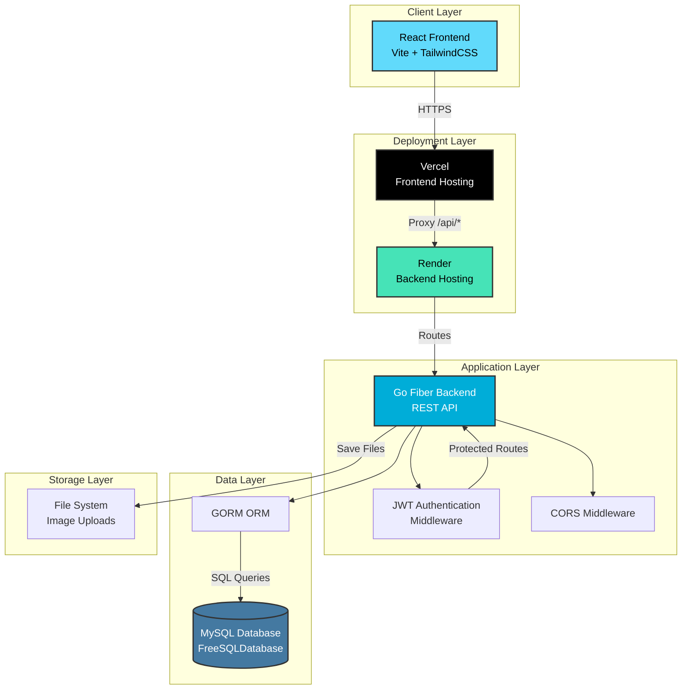
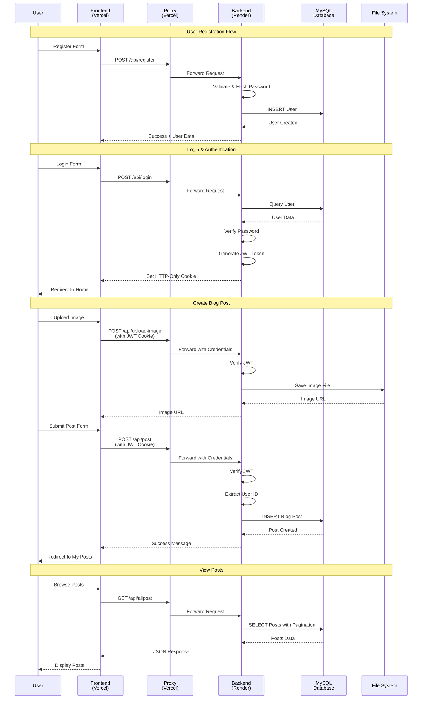
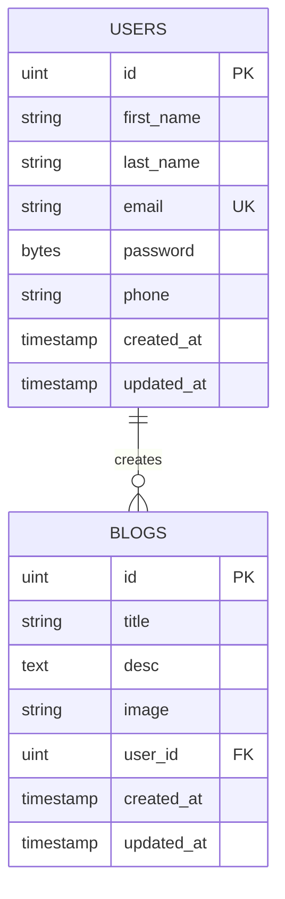

<div align="center">

# 


### A Modern Full-Stack Blogging Platform


[](https://go.dev/)
[](https://gofiber.io/)
[](https://reactjs.org/)
[](https://vitejs.dev/)
[](https://tailwindcss.com/)
[](https://www.mysql.com/)
[](https://gorm.io/)

[](https://quill-backend-lgxs.onrender.com)
[](https://quill-ten.vercel.app)

**🌐 [Live Application](https://quill-blogs.vercel.app/)** • [Backend API](https://quill-backend-lgxs.onrender.com/api/allpost) • [Report Bug](https://github.com/richochetclementine1315/Quill/issues) • [Request Feature](https://github.com/richochetclementine1315/Quill/issues)

</div>

---

## 📖 About The Project

**Quill** is a modern, full-stack blogging platform built with Go and React. It provides a seamless writing experience with a clean, responsive interface featuring light/dark mode support. Users can create, edit, and manage their blog posts with rich text content and image uploads.

### ✨ Key Features

- 🔐 **Secure Authentication** - JWT-based authentication with HTTP-only cookies
- ✍️ **Rich Text Editor** - Create and edit blog posts with image support
- 🎨 **Dark Mode** - Elegant light and dark theme toggle
- 📱 **Responsive Design** - Mobile-first approach with TailwindCSS
- 🖼️ **Image Upload** - Upload and manage post images
- 👤 **User Dashboard** - Manage your personal blog posts
- 🔍 **Post Discovery** - Browse all published posts with pagination
- ⚡ **Fast & Lightweight** - Optimized for performance

---

## 🏗️ System Architecture



---

## 🎯 Application Flow



---

## 🛠️ Tech Stack

### Backend
- **Language:** Go 1.24
- **Framework:** Fiber v2.52 - Fast HTTP framework
- **ORM:** GORM - Database operations
- **Authentication:** JWT with HTTP-only cookies
- **Database:** MySQL 8.0
- **Middleware:** CORS, Authentication

### Frontend
- **Framework:** React 18.3.1
- **Build Tool:** Vite 5.4.2
- **Styling:** TailwindCSS 3.4.10
- **Routing:** React Router v6
- **HTTP Client:** Axios 1.7.0
- **State Management:** React Context API

### Deployment
- **Backend:** Render (Free Tier)
- **Frontend:** Vercel (Free Tier)
- **Database:** FreeSQLDatabase (MySQL 8.0)
- **Storage:** Render File System (Images)

---

## 📊 Database Schema



---

## 🚀 Getting Started

### Prerequisites

- Go 1.24 or higher
- Node.js 18+ and npm/yarn
- MySQL 8.0
- Git

### Backend Setup

1. **Clone the repository**
   ```bash
   git clone https://github.com/richochetclementine1315/Quill.git
   cd Quill/QuillBackend
   ```

2. **Install dependencies**
   ```bash
   go mod download
   ```

3. **Configure environment variables**
   
   Create a `.env` file:
   ```env
   PORT=8080
   DSN=username:password@tcp(host:3306)/database?charset=utf8mb4&parseTime=True&loc=Local
   ```

4. **Create uploads directory**
   ```bash
   mkdir uploads
   ```

5. **Run the backend**
   ```bash
   go run main.go
   ```

   Backend will run on `http://localhost:8080`

### Frontend Setup

1. **Navigate to frontend directory**
   ```bash
   cd QuillFrontend
   ```

2. **Install dependencies**
   ```bash
   npm install
   ```

3. **Run development server**
   ```bash
   npm run dev
   ```

   Frontend will run on `http://localhost:5173`

---

## 📁 Project Structure

```
Quill/
├── QuillBackend/
│   ├── controller/          # Request handlers
│   │   ├── authcontroller.go
│   │   ├── imagecontroller.go
│   │   └── postcontroller.go
│   ├── database/            # Database configuration
│   │   └── connect.go
│   ├── middleware/          # Authentication middleware
│   │   └── middleware.go
│   ├── models/              # Data models
│   │   ├── blog.go
│   │   └── user.go
│   ├── routes/              # API routes
│   │   └── route.go
│   ├── utils/               # Helper functions
│   │   └── helper.go
│   ├── uploads/             # Uploaded images
│   ├── main.go              # Entry point
│   ├── go.mod
│   └── railway.toml         # Railway config
│
└── QuillFrontend/
    ├── public/              # Static assets
    │   ├── quill-logo.svg
    │   └── _redirects
    ├── src/
    │   ├── components/      # React components
    │   │   ├── Navbar.jsx
    │   │   ├── ProtectedRoute.jsx
    │   │   └── QuillLogo.jsx
    │   ├── context/         # Context providers
    │   │   ├── AuthContext.jsx
    │   │   └── ThemeContext.jsx
    │   ├── pages/           # Page components
    │   │   ├── CreatePost.jsx
    │   │   ├── EditPost.jsx
    │   │   ├── Home.jsx
    │   │   ├── Login.jsx
    │   │   ├── MyPosts.jsx
    │   │   ├── PostDetail.jsx
    │   │   └── Register.jsx
    │   ├── services/        # API service
    │   │   └── api.js
    │   ├── App.jsx
    │   ├── main.jsx
    │   └── index.css
    ├── vercel.json          # Vercel config
    ├── package.json
    └── vite.config.js
```

---

## 🔌 API Endpoints

### Public Routes

| Method | Endpoint | Description |
|--------|----------|-------------|
| POST | `/api/register` | Register new user |
| POST | `/api/login` | User login |
| GET | `/api/allpost` | Get all posts (paginated) |
| GET | `/api/allpost/:id` | Get single post by ID |

### Protected Routes (Require Authentication)

| Method | Endpoint | Description |
|--------|----------|-------------|
| POST | `/api/post` | Create new blog post |
| PUT | `/api/updatepost/:id` | Update existing post |
| DELETE | `/api/deletepost/:id` | Delete post |
| GET | `/api/uniquepost` | Get user's own posts |
| POST | `/api/upload-image` | Upload post image |

---

## 🌐 Deployment

### Backend (Render)

1. Create a new Web Service on Render
2. Connect your GitHub repository
3. Configure:
   - **Build Command:** `go build -o app`
   - **Start Command:** `./app`
   - **Environment Variables:** Add `DSN` and `PORT=8080`

### Frontend (Vercel)

1. Connect your GitHub repository to Vercel
2. Configure:
   - **Framework Preset:** Vite
   - **Root Directory:** `QuillFrontend`
   - **Build Command:** `npm run build`
   - **Output Directory:** `dist`
3. Deploy!

> **Note:** The `vercel.json` configuration automatically proxies `/api/*` requests to your backend, solving cross-origin cookie issues.

---

## 🎨 Features Showcase

### Authentication System
- Secure JWT-based authentication
- HTTP-only cookies for token storage
- Password hashing with bcrypt
- Protected routes with middleware

### Blog Management
- Create posts with rich text and images
- Edit and delete your own posts
- View all published posts
- Personal dashboard to manage posts

### User Experience
- Responsive design for all devices
- Dark/Light mode toggle
- Loading states and error handling
- Clean and intuitive interface

---

## 🤝 Contributing

Contributions are what make the open-source community such an amazing place to learn, inspire, and create. Any contributions you make are **greatly appreciated**.

1. Fork the Project
2. Create your Feature Branch (`git checkout -b feature/AmazingFeature`)
3. Commit your Changes (`git commit -m 'Add some AmazingFeature'`)
4. Push to the Branch (`git push origin feature/AmazingFeature`)
5. Open a Pull Request

---

## 📝 License

Distributed under the MIT License. See `LICENSE` for more information.

---

## 👨‍💻 Author

**Mrinmoy**

- GitHub: [@richochetclementine1315](https://github.com/richochetclementine1315)

---

## 🙏 Acknowledgments

- [Fiber](https://gofiber.io/) - Amazing Go web framework
- [React](https://reactjs.org/) - JavaScript library for UIs
- [TailwindCSS](https://tailwindcss.com/) - Utility-first CSS framework
- [GORM](https://gorm.io/) - Fantastic ORM for Go
- [Render](https://render.com/) - Free backend hosting
- [Vercel](https://vercel.com/) - Seamless frontend deployment

---

<div align="center">

### ⭐ Star this repository if you found it helpful!

Made with ❤️ and ☕

</div>
